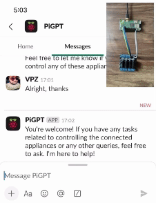

# pigpt

Control and monitor eletrical appliances, machines and more with [OpenAI](https://openai.com/)'s [ChatGPT](https://openai.com/chatgpt/) + [Raspberry Pi](https://www.raspberrypi.org/). Expose conversation-to-action capabilities from interfaces e.g., [Slack](https://slack.com/intl/en-in/) messages, [WhatsApp](https://www.whatsapp.com/) chats (using [Wapper](https://github.com/vaibhavpandeyvpz/wapper)) etc.

Uses [ngrok](https://ngrok.com/) too.



## Prepare

Before setting up the project locally, few dependencies must be satisfied.
Open a Terminal on your workstation and run below commands:

```shell
# install ngrok, if not already
brew install ngrok/ngrok/ngrok

# install pipx, if not already
brew install pipx && pipx ensurepath

# install poetry, if not already
pipx install poetry
```

## Development

Clone the project and use below commands to setup the project locally for development:

```shell
# create ngrok config, ensure <auth token> is updated
cp ngrok.dist.yml ngrok.yml

# start ngrok app
ngrok --config=ngrok.yml start pigpt

# install project dependencies
poetry install

# create slack app manifest, ensure <ngrok domain> is updated
cp slack.dist.yml slack.yml

# create a list of devices
cp devices.dist.json devices.json

# create a .env file, ensure OPENAI_* and SLACK_* variables are updated
cp .env.dist .env

# during development, turn off GPIO ops
echo MOCK_GPIO=true >> .env

# start the web server
poetry run gunicorn pigpt.web:app
```

## Deployment

To deploy to a device, connect over SSH to your favorite [Raspberry Pi](https://www.raspberrypi.org/) board and do the following:

```shell

# install rust (and Cargo)
curl https://sh.rustup.rs -sSf | sh

# install Git and Supervisor
sudo apt install -y git supervisor

# install and enable pigpio service
sudo apt install -y pigpio
sudo systemctl enable pigpiod
sudo systemctl start pigpiod

# clone project from Github
git clone https://github.com/vaibhavpandeyvpz/pigpt && cd pigpt

# install project dependencies
poetry install

# create ngrok config, ensure <auth token> is updated
cp ngrok.dist.yml ngrok.yml

# create slack app manifest, ensure <ngrok domain> is updated
cp slack.dist.yml slack.yml

# create a list of devices
cp devices.dist.json devices.json

# create a .env file, ensure OPENAI_* and SLACK_* variables are updated
cp .env.dist .env

# copy supervisor configs
cat supervisor/ngrok.conf > /etc/supervisor/conf.d/ngrok.conf
cat supervisor/pigpt.conf > /etc/supervisor/conf.d/pigpt.conf

# start all services
sudo supervisorctl reread
sudo supervisorctl update
sudo supervisorctl start all
```

# Usage

Go to Slack, create an app from `slack.yml` manifest, enable **Messaging** and chat with the `PiGPT` application.
